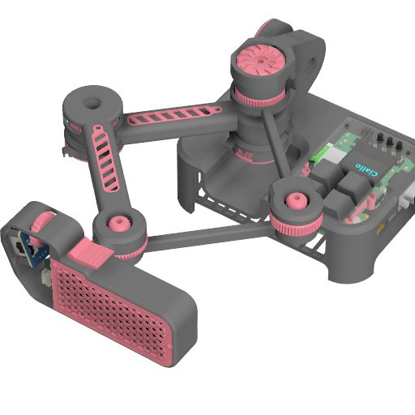

<h1 align="center">CCtrl</h1>

<p align="center">
  <strong>使用 ATmega328P 节点链路与 ESP32-S3 主控实现的空间控制器</strong>
</p>

<p align="center">
  <a href="README.md">简体中文</a> · <a href="README_EN.md">English</a>
</p>

<p align="center">
  
  
  
</p>



CCtrl 是一个面向三维姿态与空间位移交互的空间控制器项目。本仓库包含嵌入式固件、硬件工程资料、机械模型与调试工具，提供复现和二次修改所需内容。

<h5>▌快速入口</h5>

| 模块         | 中文                                                                       | English                                                                |
| ------------ | -------------------------------------------------------------------------- | ---------------------------------------------------------------------- |
| 用户手册     | [CCtrl_User_Manual_ZHCN](docs/CCtrl_User_Manual_ZHCN.md)                   | [CCtrl_User_Manual_EN](docs/CCtrl_User_Manual_EN.md)                   |
| 嵌入式固件   | [CCtrl_Embedded_Firmware_ZHCN](docs/CCtrl_Embedded_Firmware_ZHCN.md)       | [CCtrl_Embedded_Firmware_EN](docs/CCtrl_Embedded_Firmware_EN.md)       |
| 硬件工程资料 | [CCtrl_Hardware_Engineering_ZHCN](docs/CCtrl_Hardware_Engineering_ZHCN.md) | [CCtrl_Hardware_Engineering_EN](docs/CCtrl_Hardware_Engineering_EN.md) |
| 机械模型     | [CCtrl_Mechanical_Models_ZHCN](docs/CCtrl_Mechanical_Models_ZHCN.md)       | [CCtrl_Mechanical_Models_EN](docs/CCtrl_Mechanical_Models_EN.md)       |
| 调试工具     | [CCtrl_Debug_Tools_ZHCN](docs/CCtrl_Debug_Tools_ZHCN.md)                   | [CCtrl_Debug_Tools_EN](docs/CCtrl_Debug_Tools_EN.md)                   |

<h5>▌项目概览</h5>

- 基于 ESP32-S3 和四个 ATmega328P 节点的分布式架构，通过菊花链串口通信连接。
- 使用三个磁编码器（AS5600）与一个九轴 IMU（ICM20948）实现 6DoF 姿态与空间位移捕捉。
- 提供 RS232 和 USB 双输出接口。
- 提供 7 个按键、二维摇杆和滚轮等辅助输入。
- 提供相对/绝对位置模式与欧拉/四元数姿态格式切换。

<h5>▌目录结构</h5>

```text
.
├─ include/
├─ lib/
├─ src/
│  ├─ node/
│  ├─ master/
│  ├─ shared/
│  └─ ui_runtime/
├─ tools/
│  └─ unified_preview_monitor.py
├─ docs/
├─ hardware/
│  ├─ electronics/
│  └─ mechanical/
├─ platformio.ini
├─ LICENSE
├─ README.md
├─ README_ZHCN.md
└─ README_EN.md
```

<h5>▌固件构建</h5>

```bash
platformio run -e node_328p
platformio run -e master_esp32s3
platformio run -e master_esp32s3 -t upload
```

<h5>▌上位机预览</h5>

```bash
python tools/unified_preview_monitor.py
```

<h5>▌PIO 库依赖</h5>

node_328p:
- robtillaart/AS5600
- sparkfun/SparkFun 9DoF IMU Breakout - ICM 20948 - Arduino Library

master_esp32s3:
- frankboesing/FastCRC
- olikraus/U8g2

本地库：
- lib/WouoUiLiteGeneralBridge
- lib/WouoUiLiteGeneralOfficial

<h5>▌UI 框架说明</h5>

本项目 UI 方案参考并使用了来自 [RQNG/WouoUI: 模仿稚晖君MonoUI风格的超丝滑菜单，使用EC11旋转编码器控制。](https://github.com/RQNG/WouoUI) 的实现，并在当前工程中做了适配封装。

<h5>▌开源协议</h5>

本项目采用 MIT License 开源，详见 [LICENSE](LICENSE)。

<h5>▌维护状态</h5>

本项目可能不会长期高频维护，也可能不会及时审查代码或处理 Pull Request。如用于正式项目，请自行完成充分测试、代码审计与风险评估。

Made with 💗& AI

